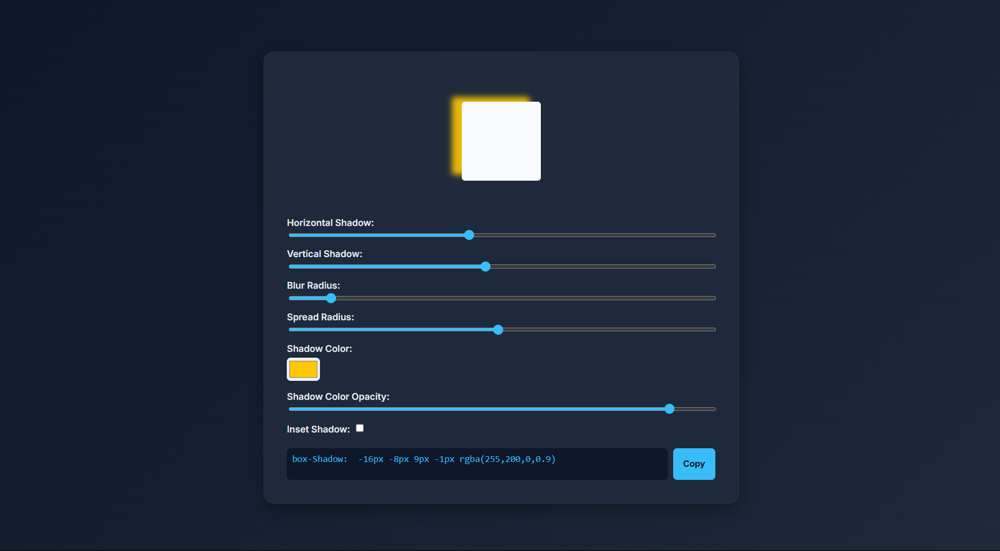

# Box Shadow Generator
An interactive and user-friendly tool for generating and copying box-shadow CSS code.

&nbsp;

## Preview

&nbsp;

## 🔗 Live Demo

&nbsp;

## Features

- 📊 Full control over all shadow parameters:

    - Horizontal Shadow

    - Vertical Shadow

    - Blur Radius

    - Spread Radius

    - Shadow color with opacity control

    - Inset shadow capability

- 🎯 Live preview of changes

- 📋 Automatic CSS code generation with one-click copy

- 📱 Responsive design for different devices

- 🎨 Beautiful and modern dark-themed UI

&nbsp;

## How to Use

- Adjust shadow parameters using sliders and color picker

- View changes in real-time in the preview box

- Generated code is displayed in the text area

- Click the "Copy" button to save the code to your clipboard

- Use the code in your CSS project

&nbsp;

## 📬 Contact

  
  
  

&nbsp;

⭐ If you like this project, give it a star and share feedback!